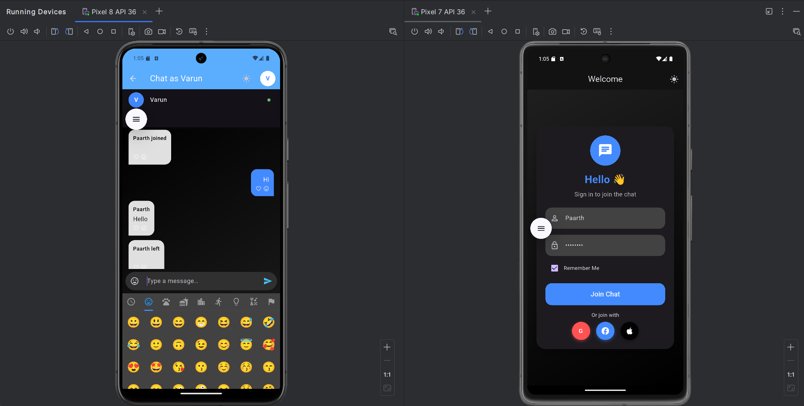
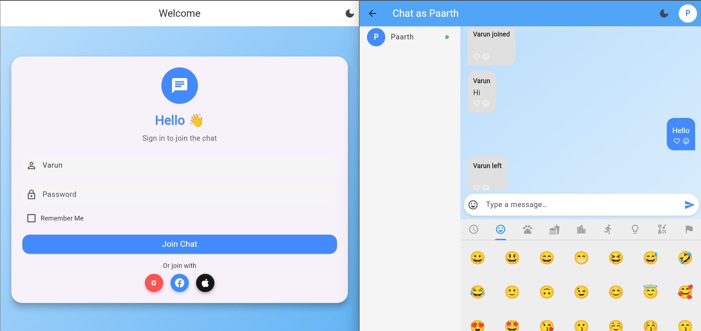

# 🚀 Realtime Chat App

A modern, cross-platform realtime chat application built with **Flutter** & **Socket.IO** on top of a **Node.js + Express** server.  
Runs seamlessly on **Android**, **iOS**, and **Web**.  

---

## ✨ Features

- 📱 Cross-platform: Android, iOS, Web
- 🔌 Realtime messaging via websockets (Socket.IO)
- 👥 Live user list with join & leave notifications
- ⌨️ Typing indicator
- 🌗 Light & Dark themes
- 🎨 Clean, modern UI

---

## 📂 Project Structure

```
- lib/
├── screens/          # LoginScreen & ChatScreen
├── services/         # SocketService (handles socket.io logic)
├── widgets/          # Custom UI components
├── main.dart         # Entry point
```
 — Flutter client app
- `chat/index.js` — Node.js + Express + Socket.IO server

---

## 🛠️ Getting Started

### 📱 Run on **Mobile (Android/iOS)**

#### Prerequisites
- Flutter installed: [flutter.dev](https://flutter.dev/docs/get-started/install)
- Android Studio or Xcode installed for emulator/simulator

#### Steps
```bash
# Clone the repository
git clone <your-repo-url>
cd <your-repo-folder>

# Install Flutter dependencies
flutter pub get

# Run on connected emulator or device
flutter run

🌐 Run on Web
Prerequisites
Flutter >= 3.0 (web support enabled)

Any modern browser

🖥️ Run the Server
Prerequisites
Node.js & npm installed: nodejs.org

🔗 Socket Events
Here are the socket events used in this app:
| **Event**       | **Direction**    | **Payload**              | **Description**                   |
| --------------- | ---------------- | ------------------------ | --------------------------------- |
| `add user`      | Client → Server  | `username`               | Add/join a user to the chat       |
| `new message`   | Client ↔ Server  | `message`                | Send/receive chat messages        |
| `typing`        | Client → Server  | —                        | Notify others user is typing      |
| `stop typing`   | Client → Server  | —                        | Notify others user stopped typing |
| `user joined`   | Server → Clients | `{ username, numUsers }` | Notify others user has joined     |
| `user left`     | Server → Clients | `{ username, numUsers }` | Notify others user has left       |
| `current users` | Server → Client  | `Array<String>`          | List of current connected users   |
| `login`         | Server → Client  | `{ numUsers }`           | Confirm login                     |

📷 Screenshots
| Mobile (Dark mode)                          | Web                                   |
| ------------------------------------------- | ------------------------------------- |
|  |  |
